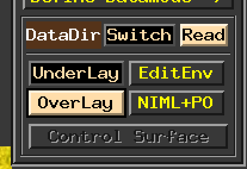
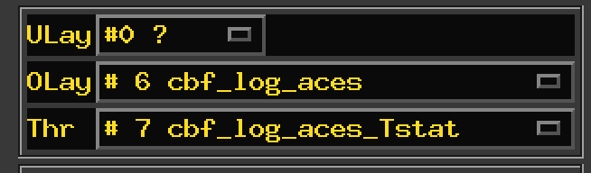
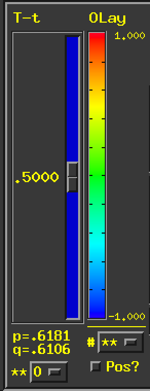
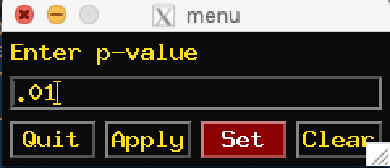
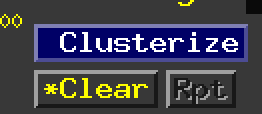
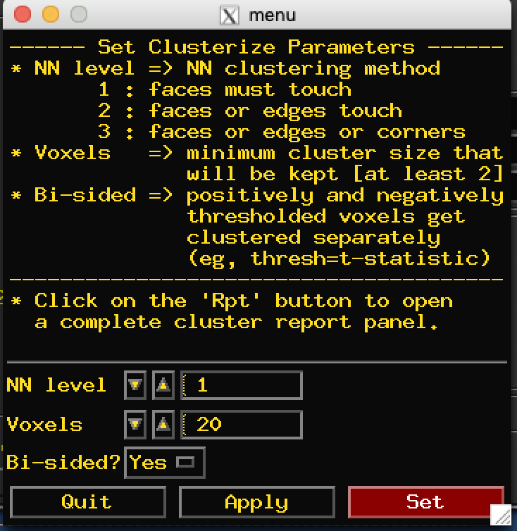
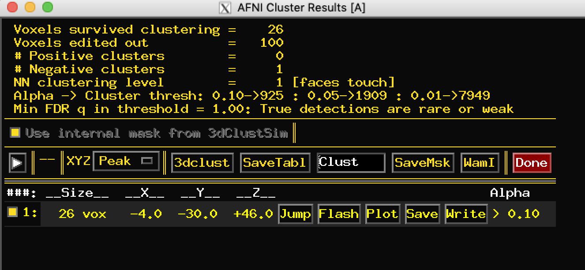

# CBF_replication
This code replicates the CBF ACEs analysis and also includes a tutorial for group analysis using AFNI.  

The data have already been preprocess and summary statistics and demographics have been organized here:  
/cbica/projects/Kristin_CBF/data/aces_flameo_2/model_aces.csv 

## Running the model
1. Look at the code aces_3dttest.sh to see detailed documentation.  
a. This code uses the excellent 3dttest++ from afni to fit the model and do the cluster simulations. 

2. We need to run the code using qsub with the `-pe threaded` flag. Let's use 30 cores. _The number of cores specified here must match the number indicated in the script_: `-ClustSim #cores`. 
It will take a little while to run.  
`qsub -pe threaded 30 aces_3dttest.sh`  

3. Now we can visualize the results!  
a. We will want to open the following files in afni: results, our scan bucket, and a template brain (to use as underlay). I have copied a template to the current directory for ease.   
b. All the data are in MNI space but the header for 3dttest output needs to be edited to reflect this (same for the scan_bucket).  
``` bash
3drefit -space MNI aces_result_clustsim.nii.gz
3drefit -space MNI scan_bucket.nii.gz
afni template.nii.gz aces_result_clustsim.nii.gz scan_bucket.nii.gz
```

### Navigating the AFNI viewer
1. Click on `underlay` and set to template.nii.gz. Click on `overlay` and set to aces_results_clustsim.nii.gz
. 
2. We are interested in the effect of aces, so we need to select this image from the overlay. This is done on the Olay and Thr dropdown menu.  
a. The `Olay` will be the regression coefficient `cbf_log_aces` and the `Thr` will be the Z stat `cbf_log_aces_Zscr`.  
. 
3. AFNI is super smart and knows the degrees of freedom of the test, so now adjust the colorbar slider (which control the Z stat threshold, will also update the p-value under the color bar)!  
. 
4. We want to select an appropriate voxelwise pvalue for the cluster correction. Usually p = .001 is standard. Here we will use p = .01 to be more liberal.
a. Right click on the `p=` text below the color bar to bring up the pval selection menu, and then select `set p value`. Type .01.  
. 
5. Now we only see voxels that survive p = .01.
6. We want to see clusters now. Click on `Clusterize`.  
. 
7. Now we set options for the clusterize function. You can read the descriptions. We want `NN = 1` and we can set the size as the default 20 for now.
a. change bi-sided? to `Yes`.  
. 
8. Click on `Rpt` to see the results.  
9. Now we see a list of all clusters that are greater than 20 voxels at p = .01.  
a. `Size` is number of voxels in the cluster.  
b. X, Y, Z coordinates of the peak voxel. 
c. Alpha tells you the cluster-level p-value (bummer, it is not significant here).  
. 
10. Click `Jump` to jump to the peak voxel of the cluster and `Flash` to flash the voxels that are in the cluster.  
11. Super cool feature. We can now view the average value for that cluster across our input dataset, the `scan_bucket.nii.gz`.  
a. Click on the white arrow next to the header row options. It will bring up a hidden menu.  
b. Click on `AUX` in the first row and select `scan_bucket.nii.gz`.  
. 
12. Now click the white arrow again to close the menu.  
13. On the row for cluster #1, click `PLOT`. This will now plot the average value for all the subjects!  
a. In this case we can see we had an outlier that is probably messing things up.  
. 
14. NOTE: Adjusting the slider threshold in the AFNI GUI will update the clusterize rpt (try setting p = .05 or p = .001).  
15. If you want to save the cluster results, you can click `Write`. This will create the file `Clust_mask_0001+tlrc.BRIK` in your current directory.  
a. In this case with only one cluster, the file will have `1` for the voxels in the cluster and `0` for everything else. You can overlay on a template like a mask.  
b. If you had multiple clusters, it would writes `1` for voxels in cluster one, `2` for voxels in cluster two, etc.  

That's all for now.

